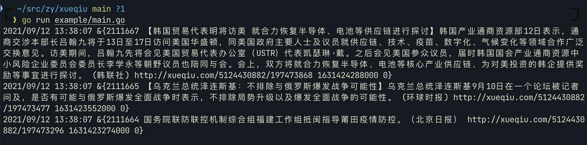

# xueqiu

雪球API Go版本。

## 注意

运行需要雪球token，获取雪球token的参考：[滚雪球 -- 提取雪球数据API Token](https://blog.crackcreed.com/diy-xue-qiu-app-shu-ju-api/)

> token在Cookie的`xq_a_token`。

## 运行示例

```bash
# 使用环境变量
export XQTOKEN="token1234567890"
go run example/main.go
```


运行结果



